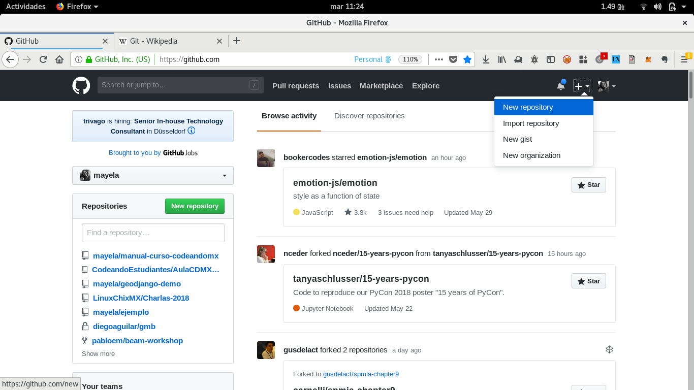
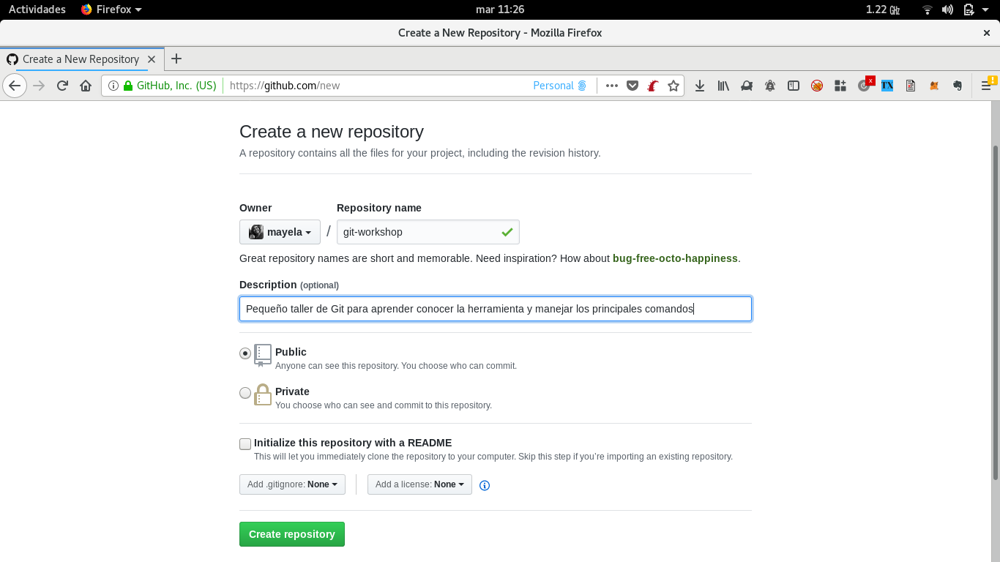
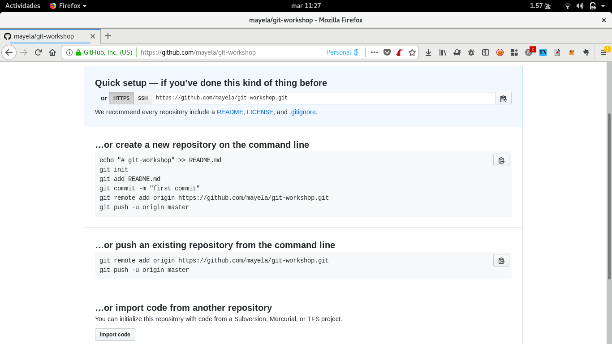

# Git Workshop

Aprenderemos Git, desde como crear un repositorio hasta como agregar un remoto y más.

## ¿Qué es Git?

Git es un sistema de control de versiones para seguir los cambios de archivos entre varios usuarios. Es principalmente usado para el manejo de código fuente dentro del desarrollo de software pero también puedo ser usado para manejar los cambios de cualquier tipo de archivo. Como sistema distribuido de control de revisiones está dirigido a la velocidad, integridad de los datos, soporte para flujos de trabajo distribuidos y no lineales[1].

### Fundamentos de Git

#### Instantáneas, no diferencias

La principal diferencia entre Git y cualquier otro VCS (Subversion y compañía incluidos) es cómo Git modela sus datos. Conceptualmente, la mayoría de los demás sistemas almacenan la información como una lista de cambios en los archivos. Estos sistemas (CVS, Subversion, Perforce, Bazaar, etc.) modelan la información que almacenan como un conjunto de archivos y las modificaciones hechas sobre cada uno de ellos a lo largo del tiempo, como ilustra la siguiente imagen


Git no modela ni almacena sus datos de este modo. En cambio, Git modela sus datos más como un conjunto de instantáneas de un mini sistema de archivos. Cada vez que confirmas un cambio, o guardas el estado de tu proyecto en Git, él básicamente hace una foto del aspecto de todos tus archivos en ese momento, y guarda una referencia a esa instantánea. Para ser eficiente, si los archivos no se han modificado, Git no almacena el archivo de nuevo, sólo un enlace al archivo anterior idéntico que ya tiene almacenado. Git modela sus datos más como en la imagen a continuación[2]


#### Los tres estados de Git

Git tiene tres estados principales en los que se pueden encontrar tus archivos: confirmado (committed), modificado (modified), y preparado (staged). Confirmado significa que los datos están almacenados de manera segura en tu base de datos local. Modificado significa que has modificado el archivo pero todavía no lo has confirmado a tu base de datos. Preparado significa que has marcado un archivo modificado en su versión actual para que vaya en tu próxima confirmación.

Esto nos lleva a las tres secciones principales de un proyecto de Git: el directorio de Git (Git directory), el directorio de trabajo (working directory), y el área de preparación (staging area).


El directorio **.git** es donde Git almacena los metadatos y la base de datos de objetos para tu proyecto. Es la parte más importante de Git, y es lo que se copia cuando clonas un repositorio desde otro ordenador.

El _directorio de trabajo_ es una copia de una versión del proyecto. Estos archivos se sacan de la base de datos comprimida en el directorio de Git, y se colocan en disco para que los puedas usar o modificar.

El _área de preparación_ es un sencillo archivo, generalmente contenido en tu directorio **.git**, que almacena información acerca de lo que va a ir en tu próxima confirmación. A veces se le denomina índice, pero se está convirtiendo en estándar el referirse a ella como el _área de preparación_.

El flujo de trabajo básico en Git es algo así:

    1. Modificas una serie de archivos en tu directorio de trabajo.
    2. Preparas los archivos, añadiendolos a tu área de preparación.
    3. Confirmas los cambios, lo que toma los archivos tal y como están en el área de preparación, y almacena esas instantáneas de manera permanente en tu directorio de Git.

Si una versión concreta de un archivo está en el directorio **.git**, se considera _confirmada_ (committed). Si ha sufrido cambios desde que se obtuvo del repositorio, pero ha sido añadida al área de preparación, está _preparada_ (staged). Y si ha sufrido cambios desde que se obtuvo del repositorio, pero no se ha preparado, está _modificada_ (modified)[2].

### Configurando Git por primera vez

Una vez que tienes instalado Git es necesario algunas cosas para personalizar tu entorno. Git contiene una herramienta llamada _git config_ que te permite obtener y establecer variables de configuración que controlan el aspecto y funcionamiento de Git. Estas variables pueden almacenarse en tres archivos distintos[3]:

- /etc/gitconfig: Contiene configuraciones de Git aplicables a todos los usuarios. Puedes hacer que Git lea o escriba a este archivo pasando la opción *--system*.
- ~/.gitconfig: Archivo específico para tu usuario. Puedes hacer que Git lea y escriba a este archivo pasando la opción _--global_.
- ./.git/config: Archivo de configuración del repositorio en el que estoy ubicado. Cada nivel sobreescribe los valores del nivel anterior, es decir que el archivo de configuración del repositorio sobreescribirá los valores de _/etc/gitconfig_ y _~/.gitconfig_.

#### Tu identidad 

Lo primero que deberías hacer cuando instalas Git es establecer tu nombre de usuario y dirección de correo electrónico. Esto es importante porque las confirmaciones de cambios (commits) en Git usan esta información, y es introducida de manera inmutable en los commits que envías[3]:

```
$ git config --global user.name "John Doe"
$ git config --global user.email johndoe@example.com
```

De nuevo, sólo necesitas hacer esto una vez si especificas la opción --global, ya que Git siempre usará esta información para todo lo que hagas en ese sistema. Si quieres sobrescribir esta información con otro nombre o dirección de correo para proyectos específicos, puedes ejecutar el comando sin la opción --global cuando estés en ese proyecto[3].

Para comprobar tu configuración solo necesitas ejecutar el siguiente comando:

```
$ git config --list
```

### Obteniendo ayuda

Si alguna vez necesitas ayuda usando Git, hay tres formas de ver la página del manual (manpage) para cualquier comando de Git[4]:

```
$ git help <comando>
$ git <comando> --help
$ man git-<comando>
```

### Inicializando un repositorio en un directorio existente

Lo primero que haremos es crear una carpeta dentro de la cual estarán los archivos a darle seguimiento.

```
$ mkdir git-workshop
$ cd git-workshop
$ git init
```

Esto crea un nuevo subdirectorio llamado .git que contiene todos los archivos necesarios del repositorio —un esqueleto de un repositorio Git. Todavía no hay nada en tu proyecto que esté bajo seguimiento[5].

Lo que sigue para agregar un remoto al repositorio que recién creamos es:

1. Crear un nuevo repositorio remoto en cualquier herramienta, en este caso usaremos Github



2. Agregar la información necesaria para la creación del nuevo repositorio remoto



3. Agregar al repositorio local el repositorio remoto que acabamos de crear



```
$ git remote add origin https://github.com/mayela/git-workshop.git
```

A estas alturas ya tenemos un creados un repositorio local y un repositorio remoto, pero aún no tenemos archivos a los cuales darles seguimiento.Si deseas empezar a controlar versiones de archivos existentes (a diferencia de un directorio vacío), probablemente deberías comenzar el seguimiento de esos archivos y hacer una confirmación inicial. Puedes conseguirlo con unos pocos comandos git add para especificar qué archivos quieres controlar, seguidos de un commit para confirmar los cambios[5]. Para esto consideraremos que ya tenemos un archivo llamado README.md al cual dar segumiento:

```
$ git add README.md
$ git commit -m "Versión inicial del proyecto"
```

Para subir los cambios al repositorio remoto solo basta ejecutar la siguiente instrucción:

```
$ git push origin master
```

### Clonando un repositorio existente

Si deseas obtener una copia de un repositorio Git existente —por ejemplo, un proyecto en el que te gustaría contribuir— el comando que necesitas es _git clone_. Puedes clonar un repositorio con _git clone [url]_. Por ejemplo, si quieres clonar unos ejercicios para Javascript llamados Koans, harías algo así[5]:

```
$ git clone https://github.com/mrdavidlaing/javascript-koans.git
```

Esto crea un directorio llamado "grit", inicializa un directorio .git en su interior, descarga toda la información de ese repositorio, y saca una copia de trabajo de la última versión.Si quieres clonar el repositorio a un directorio con otro nombre que no sea grit, puedes especificarlo con la siguiente opción de línea de comandos[5]:

```
$ git clone https://github.com/mrdavidlaing/javascript-koans.git js-koans
```

### Guardando cambios en el repositorio

Tienes un repositorio Git completo, y una copia de trabajo de los archivos de ese proyecto. Necesitas hacer algunos cambios, y confirmar instantáneas de esos cambios a tu repositorio cada vez que el proyecto alcance un estado que desees grabar.

Recuerda que cada archivo de tu directorio de trabajo puede estar en uno de estos dos estados: bajo seguimiento (tracked), o sin seguimiento (untracked). Los archivos bajo seguimiento son aquellos que existían en la última instantánea; pueden estar sin modificaciones, modificados, o preparados. Los archivos sin seguimiento son todos los demás —cualquier archivo de tu directorio que no estuviese en tu última instantánea ni está en tu área de preparación—. La primera vez que clonas un repositorio, todos tus archivos estarán bajo seguimiento y sin modificaciones, ya que los acabas de copiar y no has modificado nada[6].


#### Comprobando el estado de tus archivos

Tu principal herramienta para determinar qué archivos están en qué estado es el comando _git status_. Crea un archivo que contenga un _hola mundo_ en Javascript y luego revisa el estado de los archivos:


## References

1. [Git - Wikipedia](https://en.wikipedia.org/wiki/Git)
2. [Fundamentos de Git](https://git-scm.com/book/es/v1/Empezando-Fundamentos-de-Git)
3. [Configurando Git](https://git-scm.com/book/es/v1/Empezando-Configurando-Git-por-primera-vez)
4. [Obtener ayuda de Git](https://git-scm.com/book/es/v1/Empezando-Obteniendo-ayuda)
5. [Obteniendo un repositorio](https://git-scm.com/book/es/v1/Fundamentos-de-Git-Obteniendo-un-repositorio-Git)
6. [Guardando cambios](https://git-scm.com/book/es/v1/Fundamentos-de-Git-Guardando-cambios-en-el-repositorio)
7. 


